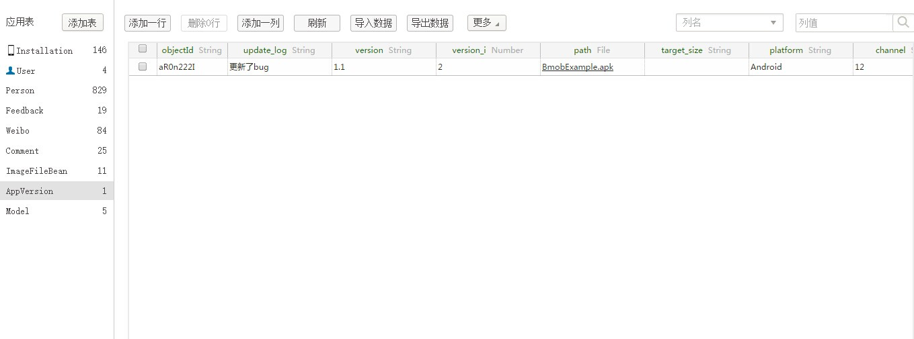
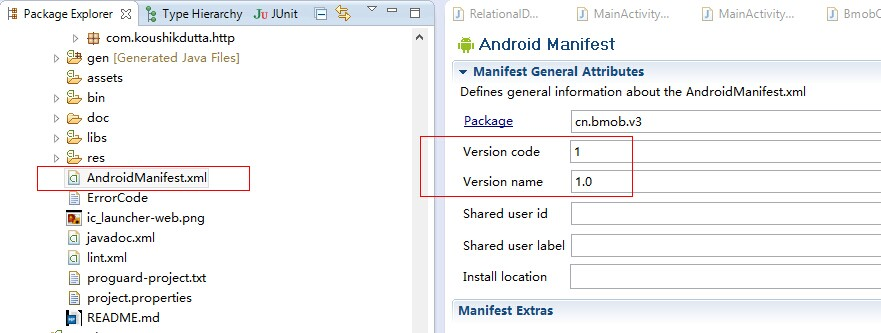

# Bmob Android自动更新组件

=====================

## 快速入门

### 添加资源文件

下载SDK提供的res文件夹拷入工程目录下，和工程本身res目录合并。

res文件夹下载地址：[http://static.bmob.cn/new/developmentdoc/appdemo/res.zip](http://static.bmob.cn/new/developmentdoc/appdemo/res.zip)

这里需要注意的是：
1. 请不要随便删除其中的文件。
2. BmobSDK提供的资源文件都以bmob_开头。

### 配置AndroidManifest.xml

1.打开AndroidManifest.xml，添加SDK需要的权限到<manifest>标签下：

```xml
<uses-permission android:name="android.permission.WRITE_EXTERNAL_STORAGE"></uses-permission>
<uses-permission android:name="android.permission.ACCESS_NETWORK_STATE"></uses-permission>
<uses-permission android:name="android.permission.INTERNET"></uses-permission>
```

说明：
- android.permission.WRITE_EXTERNAL_STORAGE 权限允许将下载的apk保存到sd卡中。
- android.permission.ACCESS_NETWORK_STATE 权限允许检查网络状态，从而根据不同网络环境决定何种下载策略,务必添加该权限。

2.添加渠道到<application>标签下： 

```xml
<meta-data android:value="Channel ID" android:name="BMOB_CHANNEL"/>
```

说明：`BMOB_CHANNEL`用来标注应用推广渠道，不同渠道可以上传不同更新包，您可以使用20位以内的英文和数字为渠道定名，替换value中的`Channel ID`。如果不添加，将不区分渠道。

3.添加Activity到<application>标签下：

```xml
<activity 
            android:name="cn.bmob.v3.update.UpdateDialogActivity"
		  	android:theme="@android:style/Theme.Translucent.NoTitleBar" >
        </activity>
```

### 调用自动更新接口

最常见的自动更新模式是：当用户进入应用首页后，如果处于wifi环境则检测更新，如果有更新，弹出对话框提示有新版本，用户点选更新开始下载更新。实现的方法是，在应用程序入口Activity里的`OnCreate()`方法中调用如下代码：

```java
public void onCreate(Bundle  savedInstanceState) {
    super.onCreate(savedInstanceState);
    BmobUpdateAgent.update(this);
}
```

考虑到用户流量的限制，目前我们默认在WiFi接入情况下才进行自动提醒。如需要在任意网络环境下都进行更新自动提醒，则请在update调用之前添加以下代码：
```java
BmobUpdateAgent.setUpdateOnlyWifi(false)
```

### 创建自动更新表

一行代码轻松搞定`AppVersion`表：

SDK提供了初始化自动创建`AppVersion`表的方法，不再需要开发者手动在web端创建。只需要在你使用自动更新功能的地方调用如下代码：

```java
BmobUpdateAgent.initAppVersion(context)
```

该表的结构如下(**如果你的应用中已经存在此表，请删除**)：

<table>
<tr>
<td>字段名称</td>
<td>字段类型</td>
<td>是否必填</td>
<td>字段说明</td>
</tr>
<tr>
<td>update_log</td>
<td>String</td>
<td>是</td>
<td>更新日志</td>
</tr>
<tr>
<td>version</td>
<td>String</td>
<td>是</td>
<td>版本名称</td>
</tr>
<tr>
<td>version_i</td>
<td>Number</td>
<td>是</td>
<td>版本号</td>
</tr>
<tr>
<td>isforce</td>
<td>Boolean</td>
<td>否</td>
<td>是否强制更新</td>
</tr>
<tr>
<td>path</td>
<td>File</td>
<td>否</td>
<td>Apk文件</td>
</tr>
<tr>
<td>target_size</td>
<td>String</td>
<td>否</td>
<td>Apk文件大小</td>
</tr>
<tr>
<td>platform</td>
<td>String</td>
<td>是</td>
<td>平台，注意："Android"为安卓平台标示，"ios"为ios平台标示</td>
</tr>
<tr>
<td>channel</td>
<td>String</td>
<td>否</td>
<td>渠道标示</td>
</tr>
<tr>
<td>android_url</td>
<td>String</td>
<td>否</td>
<td>apk市场地址（path字段和本字段必填其中一个）</td>
</tr>
<tr>
<td>ios_url</td>
<td>String</td>
<td>否</td>
<td>iOS app store地址（如果是ios记录一定要填写）</td>
</tr>
</table>

创建好这个表结构之后就可以新增一些记录，把应用的信息和下载地址（或者上传文件）填写上去，如下图所示：



**这里需要注意的是：新添加的数据记录的version_i（对应应用中的version code，如下图）的数值要大于手机中安装的应用的version number，否则无法生效。另外，platform需要根据实际情况填写平台信息。**



### 集成检测

SDK中默认开启了集成检测功能，在调用任意的更新接口后，我们将替您自动检查上述集成过程中2、3两个步骤是否被正确完成。 如果正确完成不会出现任何提示，否则会以如下的toast提示您。

你可以通过调用`BmobUpdateAgent.setUpdateCheckConfig(false)`来禁用此功能。

toast的含义如下：
"Please copy all resources (res/) from SDK to your project!"：请检查是不是把res文件夹下所有的资源文件都放到了工程中。
"Please add Permission in AndroidManifest!"：请检查上述步骤中的相关权限是否正确添加。
"Please add Activity in AndroidManifest!"：请检查上述步骤中的Activity是否正确添加。


### 强制更新

SDK中为自动更新方式提供了强制更新功能，当开发者开启强制更新功能（即将后台的`AppVersion`表中的isforce字段置为true）时，客户端调用`BmobUpdateAgent.update(context)`方法后，更新对话框只保留“立即更新”按钮且不再支持回退操作。

### 忽略版本更新

SDK中为自动更新方式提供了忽略版本更新功能，当用户勾选”忽略该版“选项时，再次调用`BmobUpdateAgent.update(context)`则不再出现版本更新对话框。

**注：强制更新和忽略版本更新只支持自动更新方式。**


## 其他更新方式

除了在快速开始文档中提到的自动更新之外，Bmob自动更新SDK还支持另外两种场景：手动更新、静默更新。
下面将详细介绍这两种场景的接口及默认行为。

### 手动更新

许多应用的设置界面中都会有检查更新等类似功能，需要用户主动触发而检测更新。它的默认行为基本和自动更新基本一致。它和自动更新的主要区别是：在这种手动更新的情况下，无论网络状况是否Wifi，无论用户是否忽略过该版本的更新，都可以像下面的示例一样在按钮的回调中发起更新检查，代替update(Context context)：
```java
public void onClick(View v) {
    BmobUpdateAgent.forceUpdate(mContext);
}
```

### 静默下载更新

当用户进入应用首页后如果处于wifi环境检测更新，如果有更新，后台下载新版本，如果下载成功，则进行通知栏展示，用户点击通知栏开始安装。静默下载过程中如果wifi断开，则会停止下载。实现的方法是：在应用程序入口Activity里的`OnCreate()`方法中调用如下代码：
```java
public void onCreate(Bundle  savedInstanceState) {
    super.onCreate(savedInstanceState);
    BmobUpdateAgent.silentUpdate(this);
}
```

# Bmob官方信息

官方网址：[http://www.bmob.cn](http://www.bmob.cn)

问答社区：[http://wenda.bmob.cn](http://wenda.bmob.cn)

技术邮箱：support@bmob.cn